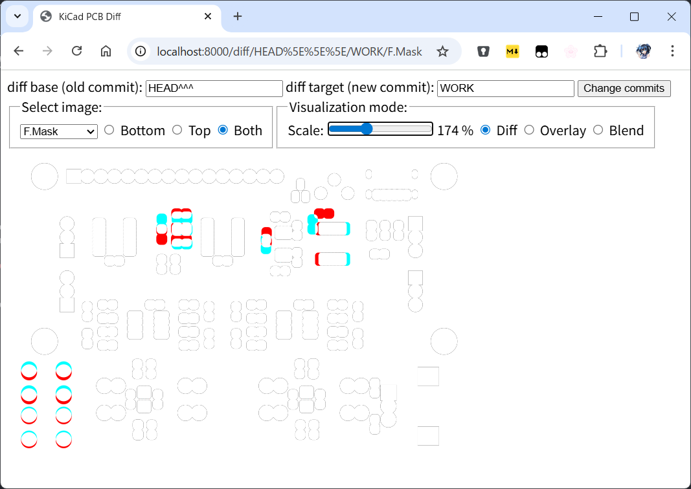

# kicad-diff-visualizer
A tool to visualize differences in PCB layouts and schematics created with KiCad.

This tool recognizes a Git repository and visualizes the difference between two commits.
Typical use cases include:
- Writing commit logs: it helps you recall design changes.
- Reviewing commit history: visual diffs are easier to understand than text diffs.

One of the key features of this tool is its minimal reliance on external dependencies.
It leverages `kicad-cli`, which comes bundled with KiCad,
to generate images for each commit and calculate the differences.

## Requirements

- `git` command
  - Ubuntu: `sudo apt install git`
- GitPython >= 3.0
  - Ubuntu: `sudo apt install python3-git`
- Jinja >= 2.10
  - Ubuntu: `sudo apt install python3-jinja2`

This program has been tested on Ubuntu running under WSL2.
Please test it on your environment and send a report or a pull request.

## Screenshot

The server shows the PCB layout differences.
- White: no diff
- Red: only in the old commit
- Blue: only in the new commit

## How to use

    $ ./run_server.sh /path/to/kicad_project_dir

or

    $ cd /path/to/kicad_project_dir
    $ /path/to/kicad-diff-visualizer/run_server.sh

Then, open http://localhost:8000/ with a Web browser.

`kicad_project_dir` refers to the directory containing a .kicad_pro file.
Alternatively, you may directly specify paths to .kicad_pcb and/or .kicad_sch.
